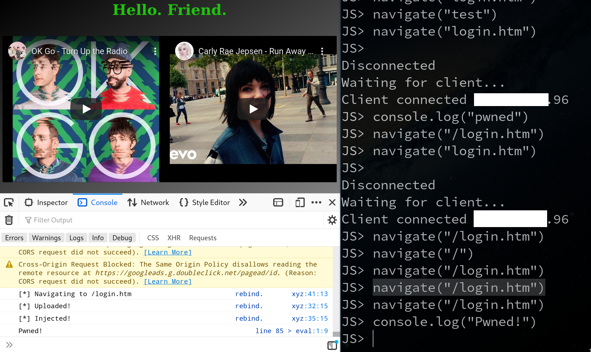

# DNS Rebinding

DNS Rebinding is essentially bypasses the Same Origin Policy on web browsers and allows a malicious website to access content on local network.
[Here](https://youtu.be/idFhbJRxdHc?t=10735) is a quick presentation on the topic and this tool.

## Installation
- Make sure that logcat.mysite.xyz points to `logcat.py` python file
- logcat.mysite.xyz must be enabled for CORS
- rebind.mysite.xyz points to payload.html
- Replace all occurrences of `mysite` to your test domain. (Use `grep mysite -R` to view and sed to replace)
- Install python `websockets` in a virtualenv or just use `pipenv install`
- Make sure inbound connections to port 80 (logcat,rebind) and 31337 (websockets) are allowed

A dummy apache config is given below
```
<Directory /home/ubuntu/mysite/dns-rebind/>
Options +ExecCGI
AddHandler cgi-script .py
</Directory>

<VirtualHost *:80>
ServerName logcat.mysite.xyz
DocumentRoot /home/ubuntu/mysite/dns-rebind/
Header always set Access-Control-Allow-Origin "*"
DirectoryIndex logcat.py
</VirtualHost>

<VirtualHost *:80>
ServerName rebind.mysite.xyz
ServerAlias rebind2.mysite.xyz
DocumentRoot /home/ubuntu/mysite/dns-rebind/
DirectoryIndex payload.html
</VirtualHost>
```

## Steps to reproduce
- Send victim to the hosted server address, here rebind.mysite.xyz
- Goto DNS Settings and point rebind.mysite.xyz to internal IP, say 192.168.1.1
- Run `python shell.py`
- Wait for the connection
- Enjoy the JS Shell
- You can inject builtin `navigate(url, method, data)` to navigate to a different page.
- navigate(...) saves fetched pages in `logcat.log/`

## Screenshot

